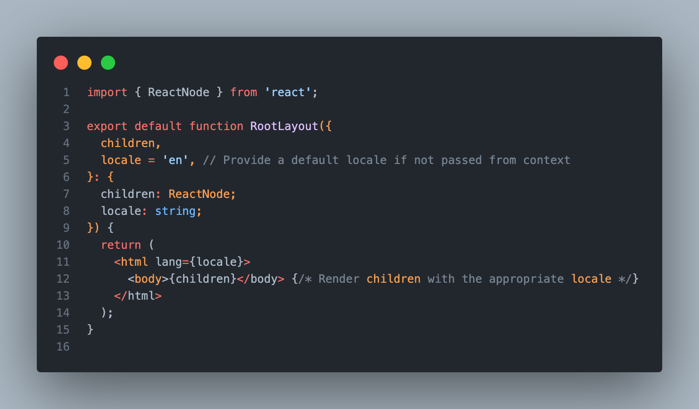
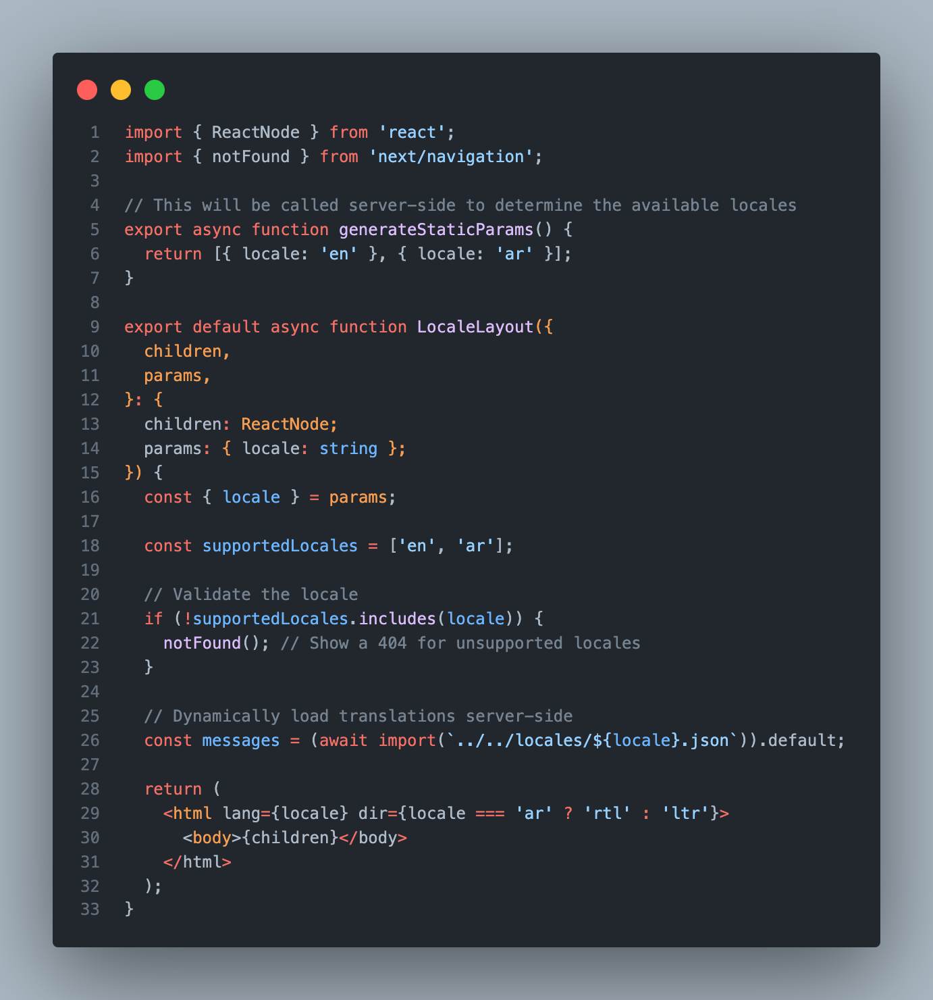
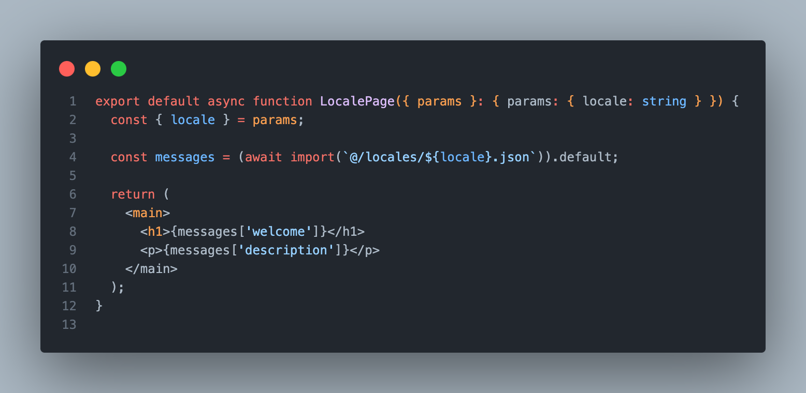

# My Next.js Multilingual App

A simple Next.js project supporting English and Arabic languages.

## Project Description

This project demonstrates a multilingual setup in Next.js using dynamic routing and client-side logic for locale management.

---

## Key Features
1. **Dynamic Routing**: Locale-based routing handled via the App Router.
2. **Client-Side Logic**: Redirecting users to their preferred locale using `next/navigation`'s `redirect()` method.
3. **Localization Implementation**: Locale-based content rendering using JSON files.
4. **Middleware Issue Fix**: Addressing inconsistencies with Next.js Middleware across versions.


## Language Issue and Fix

### **The Issue:**

We encountered challenges with **Next.js Middleware** due to inconsistent behavior across versions:

1. Middleware wasn't fully recognized in versions like `13.5.1`.
2. Partial functionality was observed in `13.4.12`, but it wasn't reliable for locale redirection.

### **Our Solution:**

Instead of relying on middleware, we implemented:

1. **Dynamic Routing**: Locale-based routing handled via the App Router.
2. **Client-Side Logic**: Redirecting users to their preferred locale using `next/navigation`'s `redirect()` method.

## Localization Implementation

### Locale Page Example

```tsx
export default async function LocalePage({ params }: { params: { locale: string } }) {
  const { locale } = params;

  const messages = (await import(`@/locales/${locale}.json`)).default;

  return (
    <main>
      <h1>{messages['welcome']}</h1>
      <p>{messages['description']}</p>
    </main>
  );
}
```

### Locale Layout Example

```tsx
import { ReactNode } from 'react';
import { notFound } from 'next/navigation';

export async function generateStaticParams() {
  return [{ locale: 'en' }, { locale: 'ar' }];
}

export default async function LocaleLayout({
  children,
  params,
}: {
  children: ReactNode;
  params: { locale: string };
}) {
  const { locale } = params;

  const supportedLocales = ['en', 'ar'];

  if (!supportedLocales.includes(locale)) {
    notFound();
  }

  const messages = (await import(`../../locales/${locale}.json`)).default;

  return (
    <html lang={locale} dir={locale === 'ar' ? 'rtl' : 'ltr'}>
      <body>{children}</body>
    </html>
  );
}
```

### Root Layout Example

```tsx
import { ReactNode } from 'react';

export default function RootLayout({
  children,
  locale = 'en', // Default locale
}: {
  children: ReactNode;
  locale: string;
}) {
  return (
    <html lang={locale}>
      <body>{children}</body>
    </html>
  );
}
```

## Addressing Middleware Issues

During implementation, middleware inconsistencies in Next.js versions posed challenges:

- Middleware did not reliably redirect users based on locales in versions such as `13.5.1`.
- As a workaround, dynamic routing and client-side logic were used for locale management, ensuring consistent behavior.

## Attachments

Below are screenshots showcasing key snippets for localization logic:

### Locale Page Logic



### Locale Layout Logic



### Root Layout Logic


